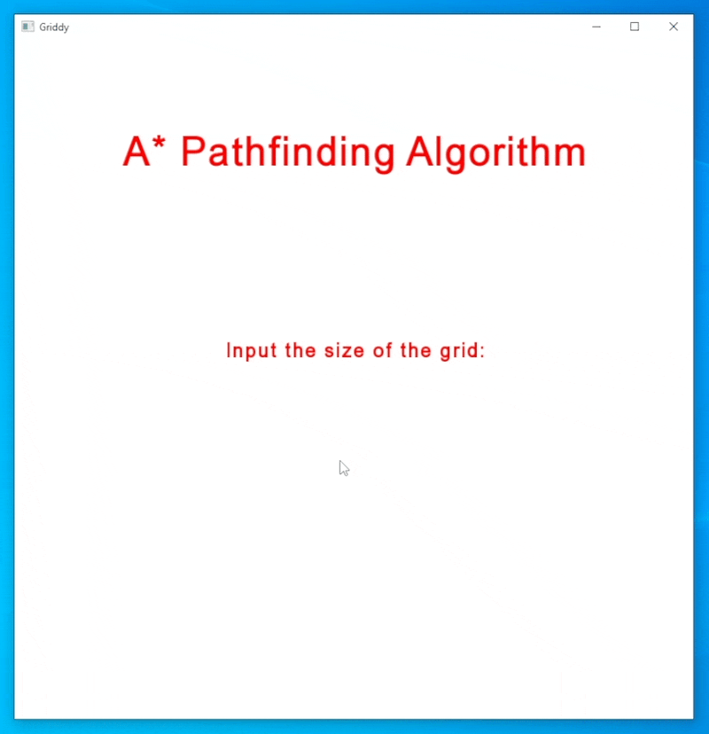

# A* Pathfinder


[A* Pathfinding Algorithm] allows users to find the shortest paths from point A to point B on a weighted graph.

This application visualizes how the algorithm would work on a 'weightless' grid: it checks the cells that are the closest to both start and goal cells and traverses further until it reaches the goal.

## How to build
1. ```git clone``` the repository
2. Run  ```git submodule init && git submodule update``` to download the SFML Library (it will take some time and may seem stuck, but be patient)
3. For Windows run ```cmake -S . -B -G "MinGW Makefiles" res/ -DBUILD_SHARED_LIBS=OFF && cd res && make && .\AStarPathfind```
4. For MacOS/Linux run ```cmake -S . -B res/ -DBUILD_SHARED_LIBS=OFF && cd res && make && ./AStarPathfind```
   
## How to use:
- Firstly, enter the size of the grid you would like to have and hit 'Enter'. 
- Now you are able to place start/end cells and obstacles ['walls']: pressing Z and clicking on the grid allows you to place the starting node, pressing X and hovering over the screen with the left mouse button pressed enables you to draw obstacles and by pressing C and clicking on the grid you are able to set the finish cell. 
- After your obstacle course is set press 'Enter' and watch the algorithm work out how to get from the starting node to the ending node. Red nodes are the nodes that have already been traversed, green nodes mean that the algorithm may consider checking and the yellow nodes will show the shortest path.

[A* Pathfinding Algorithm]: <https://en.wikipedia.org/wiki/A*_search_algorithm>
